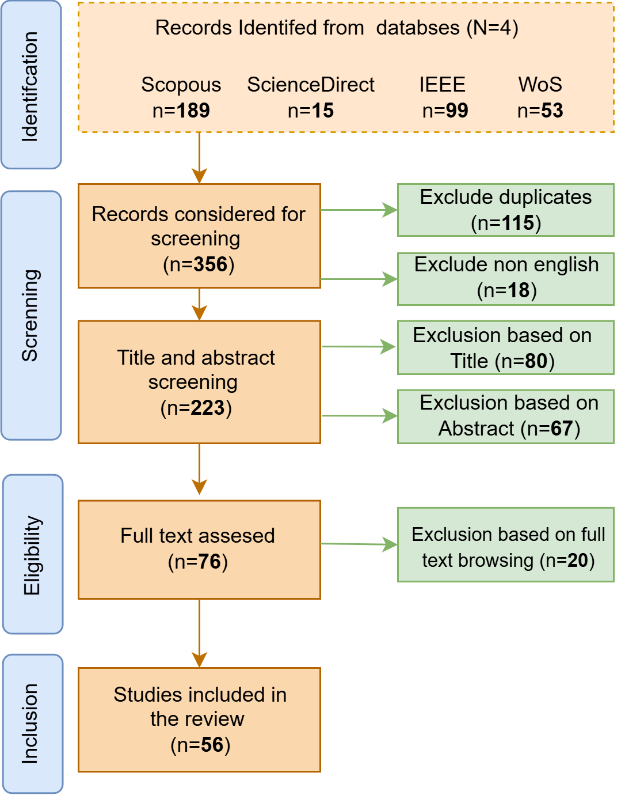

# 🧠 From Sensors to Intelligence: Large Language Models for Wearable AI

> **Tags**: `#WearableComputing` `#LargeLanguageModels` `#ContextAwareAI` `#SystematicReview` `#SensorFusion` `#HumanActivityRecognition` `#PrivacyPreservingAI` `#MultimodalLearning`

---

## 📖 About the Review

This repository accompanies the systematic literature review titled **"From Sensors to Intelligence: Large Language Models for Wearable AI."**  
The review investigates the integration of **Large Language Models (LLMs)** in wearable technology (WT) and how these models enhance various aspects of wearable systems, including:

- ✅ Context-aware intelligence  
- ✅ Human activity recognition  
- ✅ Sensor data fusion  
- ✅ Privacy-preserving learning

---

## 📚 Overview

Wearable technology, powered by multimodal data from devices such as smartwatches, fitness trackers, and smart glasses, offers rich opportunities for real-time and personalized computing. However, key challenges persist, including:

- Real-time processing  
- Energy efficiency  
- Model scalability  
- Data privacy  

This review explores how LLMs can help address these challenges through advanced multimodal learning, self-supervised techniques, and scalable model design.

---

## 📁 Repository Structure

This repository ensures transparency and reproducibility by providing the following resources:

| File | Description |
|------|-------------|
| `LLM in Wearable.xlsx` | Raw and filtered article datasets (n=356 total, 56 selected) |
| `prisma_diagram.png`  | PRISMA flowchart visualizing the screening process |

---

## 🔍 Methodology

We performed a structured search across four major academic databases:

- Scopus  
- ScienceDirect  
- IEEE Xplore  
- Web of Science

### 🧪 Screening Process

| Stage | Description | Count |
|-------|-------------|-------|
| Initial Search | Retrieval using predefined keywords | 356 articles |
| Title & Abstract Screening | Relevance filtering | ~223 retained |
| Full-text Assessment | Inclusion/exclusion applied | 76 shortlisted |
| Final Inclusion | Quality assessment | **56 articles included** |

All steps were aligned with **PRISMA 2020** guidelines for systematic reviews.

---

## 📊 PRISMA 2020 Diagram

  

---

## 🧠 Key Findings

- LLMs significantly enhance **context inference**, **personalization**, and **sensor fusion** in wearable systems.
- **Challenges** include latency, resource constraints, and deployment limitations.
- **Promising strategies** include self-supervised learning, model compression, and edge optimization.

---

## 🚀 Future Directions

We highlight the need for further research in:

- ⚙️ **On-device LLM optimization** for low-resource wearable hardware  
- 🔐 **Privacy-preserving training** via federated or edge learning paradigms  
- 🧩 **Real-time sensor fusion and adaptive reasoning** using LLMs  
- 🌐 **Ethical and transparent AI** frameworks for continuous human-centric data processing  

---

## 📥 How to Use This Repository

Researchers and practitioners can:

1. **Explore** the file(`LLM in Wearable.xlsx`)  
2. **Explore** the screening process and rationale  
3. **Replicate or extend** the review using the included search strategies  
4. **Use** the curated list for model training, benchmarking, or secondary studies  

---
